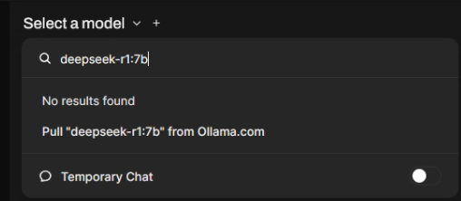

## Docker compose config for running Open WebUI Bundled with Ollama

Docker compose config to easily run Open WebUI Bundled with Ollama (with NVIDIA GPU support). Allows to run Ollama models like Deepseek R1.

## How to use

Requirements:
- [Docker](https://docs.docker.com/engine/install/) installed on your system
- [NVIDIA Container Toolkit](https://docs.nvidia.com/datacenter/cloud-native/container-toolkit/latest/install-guide.html) installed on your system

While in project folder
1. (Optional) If want to customize container configs (for example service port) create ```.env``` file using  ```.env.example``` as a reference. 
2. Run `docker compose up -d`.
3. Wait for application to fully start (you check the logs with ```docker compose logs -f```, look for a message ```Application startup complete```)
4. Open Web UI interface is available on ```http://locahost:{APP_PORT}``` (by default http://locahost:8000).
5. Use Open Web UI interface to pull model you want to run from Ollama.com.


For available models visit [Ollama Models](https://ollama.com/search)

For more information on Ollama and Open WebUI reference:
- [Ollama homepage](https://ollama.com/)
- [Open WebUI documentation](https://docs.openwebui.com/)